<h1 align="center">📔 Geeks shell</h1>

<h2 align="center">shell脚本语法 学习笔记</h2>

- [00. 使用环境和说明](#00-使用环境和说明)
- [01. shell概述](#01-shell概述)
  - [1.1 脚本解释器](#11-脚本解释器)
  - [1.2 调用脚本](#12-调用脚本)
  - [1.3 第一个脚本helloworld](#13-第一个脚本helloworld)
  - [1.4 Linux管道](#14-linux管道)
- [02. shell中特殊字符](#02-shell中特殊字符)
  - [03. 转义符](#03-转义符)
- [04. shell中参数：`$0`、`$?`、`$!`、`$$`、`$*`、`$#`、`$@`](#04-shell中参数0)
- [5. 变量问题](#5-变量问题)
- [5.1 shell变量概述](#51-shell变量概述)
  - [5.2 内部变量（系统变量）](#52-内部变量系统变量)
  - [5.3 自定义变量基本语法](#53-自定义变量基本语法)
  - [5.4 环境变量](#54-环境变量)
  - [5.5 引用变量](#55-引用变量)
- [6. 运算符](#6-运算符)
  - [6.1 赋值运算符符](#61-赋值运算符符)
  - [6.2 算术运算符](#62-算术运算符)
  - [6.3 位运算符](#63-位运算符)
  - [6.4 比较运算符](#64-比较运算符)
  - [6.5 逻辑运算符](#65-逻辑运算符)
- [7. 操作字符串](#7-操作字符串)
  - [7.1 字符串的长度](#71-字符串的长度)
  - [7.2 索引子串第一次出现的位置](#72-索引子串第一次出现的位置)
  - [7.3 提取子串](#73-提取子串)
  - [7.4 子串截除](#74-子串截除)
  - [7.5 子串替换](#75-子串替换)
  - [7.5](#75)
- [8. 数组](#8-数组)
  - [8.1 初始化方式](#81-初始化方式)
  - [8.2 获取数组中的元素](#82-获取数组中的元素)
  - [8.3 删除数组元素](#83-删除数组元素)
  - [8.4 二维数组](#84-二维数组)
- [9. 分支与循环控制](#9-分支与循环控制)
  - [9.1 if和if嵌套](#91-if和if嵌套)
  - [9.2 for循环](#92-for循环)
  - [9.3 while循环语句](#93-while循环语句)
  - [9.4 until循环语句](#94-until循环语句)
  - [9.5 break和continue语句](#95-break和continue语句)
  - [9.6 case结构语句](#96-case结构语句)
  - [9.7 select结构语句](#97-select结构语句)
- [10. 函数](#10-函数)
  - [10.1 自定义函数](#101-自定义函数)
  - [10.2 函数的调用](#102-函数的调用)
  - [10.5 系统函数](#105-系统函数)
- [11. 字符串的显示颜色](#11-字符串的显示颜色)
- [12. I/O重定向](#12-io重定向)
  - [12.1 重定向符号及功能说明](#121-重定向符号及功能说明)
  - [12.2 关闭文件描述符](#122-关闭文件描述符)
  - [12.3 代码块重定向](#123-代码块重定向)
- [13. 正则表达式](#13-正则表达式)
  - [13.1 正则表达式组成](#131-正则表达式组成)
  - [13.2 POSIX字符类 `[:class:]`](#132-posix字符类-class)
  - [13.2 扩展RE字符](#132-扩展re字符)
  - [13.1 应用场景](#131-应用场景)
- [14. Linux / shell中一些命令说明](#14-linux--shell中一些命令说明)
  - [14.1 set/ unset命令 -- 设置/取消赋值](#141-set-unset命令----设置取消赋值)
  - [14.2 read命令 -- 从控制台读取输入](#142-read命令----从控制台读取输入)
  - [14.3 declare命令 -- 声明shell变量](#143-declare命令----声明shell变量)
  - [14.4 let命令 -- 计算算术表达式](#144-let命令----计算算术表达式)
  - [14.5 expr命令 -- 表达式](#145-expr命令----表达式)
  - [14.6 test命令 -- 判断检查](#146-test命令----判断检查)
- [15. Linux三剑客 --- grep](#15-linux三剑客-----grep)
  - [15.1 常用查找option说明](#151-常用查找option说明)
  - [15.2 输出控制option说明](#152-输出控制option说明)
  - [15.3 其他两个常用RE进行的grep操作](#153-其他两个常用re进行的grep操作)
- [16. Linux三剑客 --- sed](#16-linux三剑客-----sed)
  - [16.1 替换/修改字符串](#161-替换修改字符串)
  - [16.2 换行、删除](#162-换行删除)
  - [16.3 注释](#163-注释)
  - [16.4 查看指定的行范围的内容](#164-查看指定的行范围的内容)
- [17. Linux三剑客 --- awk](#17-linux三剑客-----awk)
  - [17.1 语法格式](#171-语法格式)
  - [17.2 awk的原理](#172-awk的原理)
- [18. shell脚本静态检查 --- shellcheck](#18-shell脚本静态检查-----shellcheck)
  - [安装方式](#安装方式)
  - [使用方式](#使用方式)
- [19. 参考资源](#19-参考资源)

## 00. 使用环境和说明
- centos8 
- Kernel 4.18.0-305.12.1.el8_4.x86_64
- x86_64 GNU/Linux
- bash 版本：4.4.20
- **本文不介绍和Linux 指令相关的内容**
- **先修内容：`Linux基本命令`（推荐书籍：`《鸟哥Linux私房菜:基础学习》`）**
- **只介绍本人在场景中使用后，结合参考书籍做的一个学习笔记，未使用过的暂时不更新**
- **部分图片来源书籍《高级Bash脚本编程指南》**
- **所有笔记的内容均可通过 `cmd --help` 查看具体的用法**

## 01. shell概述
在shell中，每个脚本的开头都使用 `#!` ，就是告知系统文件的执行都需要指定一个`解释器`。指定一个文件类型的特殊标记。占用 `2 字节` 。

### 1.1 脚本解释器
shell脚本都是以 `#!`开头，告知系统该文件的执行需要一个解释器。
常见的解释器类型如下：
```shell
#!/bin/sh
#!/bin/bash
#!/usr/bin/perl
#!/usr/bin/tcl
#!/bin/sed -f
#!/usr/awk -f
```
解释说明
- `#!/bin/sh` linux系统上默认是bash，多数UNIX商业OS中也默认shell。

### 1.2 调用脚本
执行脚本的三种方式：
```sh
#方式1
sh helloworld.sh
#方式2
bash helloworld.sh
bash +x helloworld.sh
```
第三种方式有一点特殊

```sh
./helloworld.sh             #需给文件授予执行权限

#实授予权限的方式如下
chmod +x helloworld.sh      #授予可执行权限
chmod +rx helloworld.sh     #授予任何人可执行可读和可执行权限
chmod u+rx helloworld.sh    #只给脚本的所有者可读和可执行权限
```

### 1.3 第一个脚本helloworld
```sh
#!/bin/bash

echo "helloworld"
```
目前Linux/unix系统中，普遍的shell脚本的第一行是：`#!/bin/sh` 或者 `#!/bin/bash`。

### 1.4 Linux管道
在Linux中可以将两个或者多个命令连接到一起的符号`(|)`，称为`管道符`。

思想：把上一个命令的输出作为下一个命令的输入（也就是因连接而形成`管道（pipe）`概念）。


语法格式：
```
command_1 | command_2 | ... | command_N
# 最简单的管道
cat helloworld.sh | grep hello
```
⚠️注意：有输出才能输入，所以输出出现错误，则输入部分将无法处理。

管道的应用：在`grep`、`tail`、`cat`、`sed`、`awk`等Linux命令中较为常见。

## 02. shell中特殊字符

|特殊字符|功能|说明|注意|
|:--:|--|--|--|
|`#`|1.注释<br>2.声明命令解释器的类型<br>3.某些特定的模式匹配操作使用|1.注释方面：一般是`行首`中以 `#`作为开头<br>2.声明解释器类型一般是在`脚本第一行`。*使用格式：`#!/bin/bash`*|命令不能和注释在同一行上，也就是注释的后面|
|`;`|命令分隔符，可以在同一行上写多个命令|某些情况需要使用转义符转义||
|`;;`|双分号，终止case选项|||
|`.`|bash内置命令|1.点`(.)`放在文件名前面表示隐藏文件。<br>2.移动文件操作时，如果是单独点作为参数`cp cxx/helloworld.sh .`表示当前工作目录<br>3.两个点`(..)`，表示上一级目录。<br>4.正则表达式中作为匹配任何的单个字符|||
|`" "`|双引号表示字符串|||
|`' '`|单引号表示字符|||
|`,`|逗号操作符|链接一系列操作||
|`\`|反斜杠`(\)`|对单个字符的引用机制|一般用来转义`双引号(" ")` 和`单引号(' ')`。||
|`/`|正斜杠`(/)`|1.作为文件名路径分隔符`/data/cxx/Makefile`<br>2.用作除法算术操作符||
|`*`|1.乘法算术操作符<br>2.两个`（**）`表示求幂运算符<br>3.通配符，可以用来匹配给定目录下的任何文件名|||
|`?`|1.测试通配符<br>2.通配符，在正则表达式中表示一个字符，也可以用来匹配单个字符。|在表达式中测试一个条件的结果，类似C语言中的三元操作符。|||
|`$`|1.引用变量<br>2.正则表达式中，表示`行结束符`。|||
|`${}`|参数替换|||
|`$* or $@`|位置参数|||
|`$$`|进程ID变量|保存所在脚本的进程ID||
|`$?`|退出状态码变量|可保存命令、函数或者脚本本身的退出状态码|一般是`0`或 `1`。|
|`{ }`|大括号，代码块，也叫作内部组。|在函数或者判断语句中使用代码块|~~在大括号中不允许有空白，除非空白被引用或者转义~~|
|`[ ]`|1.测试条件<br>2.数组元素 <br>3.字符范围|作为字符范围时，方括号描述一个匹配的字符范围||
|`> &> >& >> < <>`|重定向|||

### 03. 转义符
转义符是一种引用单个字符的方法。添加`转义符（\）` 使得shell中的某个字符失去原有特殊含义。

注意：在`echo` 和 `sed` 中谨慎使用转义符，否则会有相反效果。

|转义符|含义|实例|
|--|--|--|
|`\n`|表示新的一行|`echo "first line";echo $'\n';echo "third line"`|
|`\r`|表示回车||
|`\t`|表示水平制表符||
|`\v`|表示垂直制表符||
|`\b`|表示后退符||
|`\a`|表示"alert" (蜂鸣器或闪烁)||
|`\0xx`|转换为八进制的ASCII码，等价于*0xx*||
|`\"`|表示双引号||
|`\$`|表示`$`本身的意思，跟在后面的变量名不会起作用|`echo "\$variables~~~~"`|
|`\\`|表示反斜线|`echo "\\" #结果为 \`||


~~赋值给变量的字符串的元素也会被转义, 但是不能把一个单独的转义符赋值给变量。~~

## 04. shell中参数：`$0`、`$?`、`$!`、`$$`、`$*`、`$#`、`$@`
|字符符号|功能（用途）|
|:--:|--|
|`$0`|shell文件本身的`文件名`|
|`$1～$n`|添加到Shell的`各参数值`。`$1是第1参数、$2是第2参数、…、$n表示第n个参数`。⚠️注意：10以上要用大括号，如{10}。|
|`$?`|最后运行命令的`结束代码（返回值）`，执行`成功`返回`0`，`不成功`则返回`非零值（一般解释为错误码）`。|
|`$$`|Shell本身的PID（ProcessID）|
|`$!`|Shell最后运行的`后台Process的PID`|
|`$-`|使用Set命令设定的Flag一览|
|`$*`|所有参数列表。如 `"$*"用「"」括起来的情况、以"$1 $2 … $n"` 的形式输出所有参数。|
|`$@`|所有参数列表。如 `"$@"用「"」括起来的情况、以"$1" "$2" … "$n"` 的形式输出所有参数。|
|`$#`|添加到Shell的参数个数||

**`$*` 和 `$#` 的区别**：
- 不被双引号包含时，两者没有区别。
- 当被`双引号包含`时， `$*` 是将`所有参数`看作`一整个数据`。而 `$#` 则是将`每个参数`看作`一个数据`。

具体实例脚本：
```sh
#!/bin/bash
# 已进行shellcheck检查
echo "This is \$0 ---- : $0"
echo "This is \$1 ---- : $1"
echo "This is \$2 ---- : $2"
echo "This is \$? ---- : $?"
echo "This is \$$ ---- : $$"
echo "This is \$! ---- : $!"
echo "This is \$_ ---- : $_"
echo "This is \$* ---- : $*"
echo "This is \$@ ---- : $*@"
echo "This is \$# ---- : $#"
```
直接执行且打印信息如下：
```sh
bash +x paramshell.sh 7 77

#打印信息
This is $0 ---- : paramshell.sh         # 显示文件名
This is $1 ---- : 7                     # 第1个参数
This is $2 ---- : 77                    # 第2个参数
This is $? ---- : 0                     # 执行完毕后的返回值 0 --- True，1 --- False
This is $$ ---- : 1549879               # 该程序执行时的本身进程ID
This is $! ---- :                       # shell后台运行的进程ID
This is $_ ---- : This is $! ---- :     # 变量保存之前执行命令的最后一个参数的值
This is $* ---- : 7 77                  # 参数值列表
This is $@ ---- : 7 77                  # 参数值列表
This is $# ---- : 2                     # 参数的个数
```

## 5. 变量问题
变量表示数据的方法。是计算机为了保存数据项而在内存中分配的一个位置或一组位置的标识或名字。

变量名就是`保存值的地方`。

## 5.1 shell变量概述
shell变量有系统变量和自定义变量两种。

对于变量名的声明规则类似于其他编程语言。由字母、数字、下划线组成，但不能以数字开头。
```sh
hello_123       # 合法
123_hello       # 不合法
```

### 5.2 内部变量（系统变量）
主要记录实际工作中使用的，也不要记住。用到了再查即可。

|系统变量|说明|实操|备注|
|:--|:--|:--|:--|
|`$BASH_VERSION`|查看bash的版本|`echo $BASH_VERSION`||
|`$BASH`|bash的二进制程序文件的路径|`echo $BASH`||
|`$USER`|当前用户|`echo $USER`|一般是root|
|`$EUID`|有效用户ID|`echo $EUID`|`$EUID` 不一定与`$UID`相同|
|`$FUNCTION`|在函数中，可直接打印当前函数的名字|
|`$GROUP`|当前用户所属的组|`echo $GROUP`|一个组ID列表|
|`$HOSTNAME`|当前主机名字|`echo $HOSTNAME`|
|`$HOSTTYPE`|当前主机类型|`echo $HOSTTYPE`|
|`$PATH`|可执行文件的搜索路径|`echo $PATH`|以冒号分隔的目录列表|
|`pwd`|当前工作目录|`pwd`||

### 5.3 自定义变量基本语法
- **定义变量**：`变量名=变量值`，等号两侧不能有空格（与其它语言可设空格的区别之处）。变量名一般习惯使用大写。
- **设置变量**：`set 变量名=变量值`。
- **删除变量**：`unset 变量名=变量值`。
- **声明静态变量**：readonly 变量名，静态变量不能用unset
- **使用变量**：$变量名
- **变量赋值**
    - **简单赋值**：a=123 && echo $a
    - **命令行赋值给变量**
        ```sh
        #使用反引号
        str=`cat helloworld.sh`
        #直接使用 $(..)格式
        os=$(cat /etc/os-release)
        ```
- **局部变量**：只在代码块或函数中可见可用。外部不可用。
- **Bash变量**：不区分类型，都是字符串，不允许进行数值计算，除非变量中包含数字。
- 如果变量的值`中间有空格`，则使用`引号（单引号或双引号均可）`扩起来。

### 5.4 环境变量
会影响用户接口和shell的行为。环境变量是一个全局变量。

通过 export 命令将变量声明为环境变量即可。
```shell
export 变量名=变量值
# 方式 1 :直接export导入，命令行窗口重启后失效
export LD_LIBRARY_PATH=/usr/local/cuda/lib

# 方式 2
# 加入到 root目录下的 .bashrc 中
# 使用 source ./bashrc 使修改后的配置信息生效，命令行窗口重启或者机器重启均不会失效
# 查看环境变量是否生效
echo $变量名
echo $LD_LIBRARY_PATH
```

对于环境变量的查看
```sh
# 方式 1 ：查看所有变量（包括环境变量和自定义变量）
set
# 方式 2 ：只能查看环境变量
env
```

### 5.5 引用变量
引用：将字符串使用双引号扩起来。作用：保护字符串的特殊字符（通配符）不被shell重新解释或者扩展。

```shell
[root@centos8 data]# var01=3
[root@centos8 data]# echo $var01
3
```
在引用变量时，需要使用`$`来进行引用变量的值。

变量在使用过程中，如果没有`$`作为前缀，需要思考如下情况：
- 被声明或被赋值。
- 是否被`unset`
- 被使用`export `方式导入
- 是否作为信号量。
- 赋值的两种方式：
	- 使用 `=` 方式。
	- 直接使用`read`命令。
## 6. 运算符

### 6.1 赋值运算符符
`=`： 通用赋值操作符，可用于算术和字符串的赋值。

### 6.2 算术运算符
|运算符|描述|备注|
|:--|:--|:--|
|`+`|加法|延伸 `+=`|
|`-`|减法|延伸 `-=`|
|`*`|乘法|延伸 `*=`|
|`**`|求幂||
|`/`|除法|延伸 `/=`|
|`%`|求模（余数）|延伸 `%=`|
|`++`|自增|a++ 等于 a = a + 1|
|`--`|自减|a-- 等于 a = a - 1|

⚠️注意：运算符(`+|-|*|/|%`)= 表示：将变量的值（`+|-|*|/|%`）另一个常量值，然后再将结果赋值给变量。

具体实例：
```sh
#!/bin/bash
# 未进行shellcheck检查
a=5

let a+=2
echo "plus : $a "       # a = 7 和

let a-=2
echo "minus : $a"       # a = 5 差

let a*=2
echo "multi : $a"       # a = 10 积

let a/=2
echo "div : $a"         # a = 5 商

let a%=2
echo "Modulo : $a"      # a = 1 余数
```

### 6.3 位运算符
使用较少，暂时不做更新学习。

### 6.4 比较运算符
|运算符|英文全称|中文描述|示例|
|:--|:--|:--|:--|
|-eq|equal|等于|[ 1 -eq 1 ]为 true|
|-ne|not equal|不等于|[ 1 -ne 1 ]为 false|
|-gt|greater than|大于|[ 2 -gt 1 ]为 true|
|-lt|lesser than|小于|[ 2 -lt 1 ]为 false|
|-ge|greater or equal|大于或等于|[ 2 -ge 1 ]为 tbnrue|
|-le|lesser or equal|小于或等于|[ 2 -le 1 ]为 false|


### 6.5 逻辑运算符
|运算符|描述|等价使用|具体说明|
|:--|:--|:--|:--|
|`&&`|逻辑与（AND）|`-a`|需两个为True|
|`\|\|`|逻辑或（OR）|`-o`|其中之一为True|

## 7. 操作字符串
字符串是由`单引号（''）` 或者 `双引号（""）` 或者也可不用引号。

- 单引号
    - 原样输出（变量依然原样输出）
    - 单引号内不能再使用单引号。
- 双引号

    - 如果其中使用了变量，则变量内容也会被替换。
    - 如果再次使用引号，则使用转义符。

- 不用引号 
    - 性质和双引号一致，但是字符串不能有空格。

### 7.1 字符串的长度
直接使用 `${#string}` 来计算字符串的长度

```sh
# 3 个语法格式
${#string}              # 方式 1
expr length $string     # 方式 2
expr "$string" : '.*'   # 方式 3

# 具体实例
str="hello world"
echo "After using #str : ${#str}"
echo "Use expr length : $(expr length "$str")" # 该方式不建议使用，因为shellcheck也建议使用第一种方式
echo "Use expr : $(expr "$str" : '.*')"
```

### 7.2 索引子串第一次出现的位置
```sh
# 语法格式 ： 
expr index "$string" '$substring'

# 详细实例 ---- 未进行shellcheck检查
str="SolerHO123456"
echo $(expr index "$str" H) # 结果为 6
```

### 7.3 提取子串
目的：提取一些特殊需求的字符。

|语法|说明|
|:--|:--|
|`${string:position}` | 在string中从位置position开始提取子串 |
|`${string:position:length}`|在string中从位置position开始提取 length长度的字串|


### 7.4 子串截除

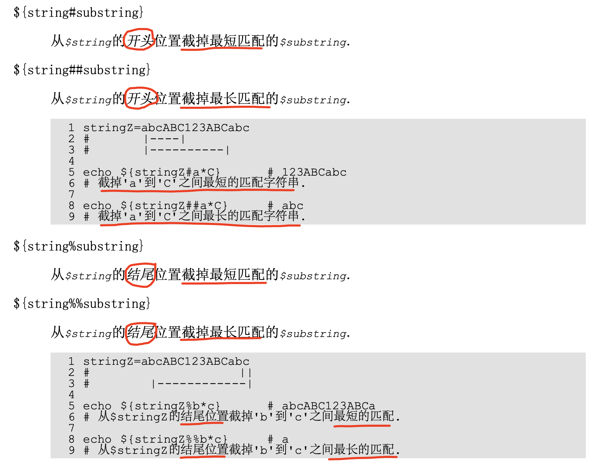

### 7.5 子串替换

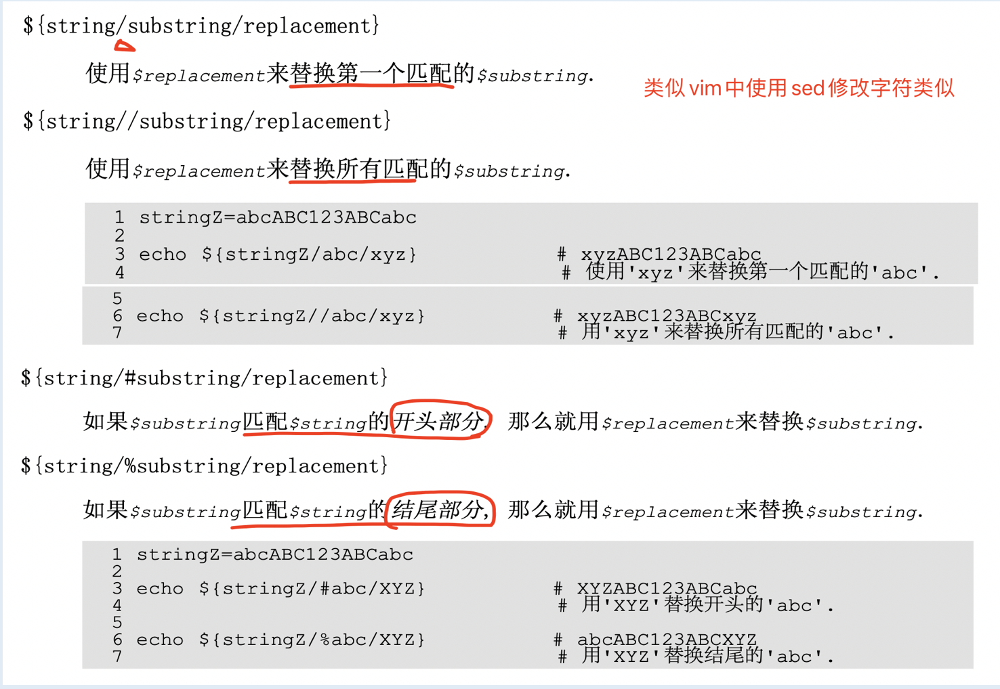

### 7.5 

## 8. 数组
bash支持**只支持一维数组**。数组元素可使用符号 `var[number]` 来初始化。

脚本使用 `declare -a var` 语句来指定一个数组。

数组访问：通过`下标`的方式访问 --- `${var[number]}`。数组元素的下标由`0开始`，和C语言类似。下标可以是`整数`或`算术表达式`，其`值应大于或等于0`。

在数组中，`${#array[*]}` 和 `${#array[@]}` 表示数组中`元素的个数`。

### 8.1 初始化方式
shell中使用括号来表示数组，元素之间则使用 `空格符号` 分隔。
```sh
# 等号两边不能空格
array_name=(element_1 element_2 ... element_N)

# 声明偶数
arr_odd=(1 3 5 7 9)
```

### 8.2 获取数组中的元素
```sh
# 数组名[索引] 方式
$(array_name[index])

# 示例
echo ${arr_odd[2]}
```

打印数组中所有元素

```shell
${arr_odd[*]}  # 建议使用该方式
${arr_odd[@]}  # 该方式在shellcheck中会无法认可，对
```

在数组声明时添加一个额外的 `declare -a语句`，可加速后续的数组操作速度。
```sh
declare -a arr_name=(...)
```

### 8.3 删除数组元素
在shell中，使用unset命令来删除数组元素。语法格式：
```sh
# 删除特定的元素
unset array_name[index]

# 删除整个数组
unset array_name    # 使用数组名，不写下标
```

### 8.4 二维数组
`二维数组`本质也是`一维数组`。通过 `行` 和 `列` 的寻址方式来对数组进行引用和操作。

在`一维数组`中由`单行`组成，而`二维数组`由`连续的多行`组成。

## 9. 分支与循环控制
- 双中括号` [[ ... ]]` 结构

    在bash中，引入 `[[ ... ]]` 扩展测试命令。这种方式一般直接使用数学符号判断时使用。例如
    ```sh
    if [[ "$1" > "$2" ]];then
    ```
- 双圆括号`((...))` 结构

    允许进行算术扩展和赋值。例如：`a=$(( 5 + 3 ))`。该风格类似于C语言风格中的变量操作处理方式。

### 9.1 if和if嵌套
`if/then结构`用来判断命令列表的`退出状态码`是否为`0`。

- if单分支

    语法格式：
    ```sh
    if [ condition ];then
        command1
        command2
        ...
    fi # 注意不能少了fi结尾
    #例如
    if [ "$1" -gt 18 ];then
        echo "you are an adult"
    fi
    ```

- if多分支

    语法格式：
    ```sh
    if [ condition ];then
        command1
        command2
        ...
    else
        command3
    fi
    #例如
    if [ "$1" -gt 18 ];then
        echo "you are an adult"
    else
        echo "You are a minor and you should study hard"
    fi
    ```

- if嵌套

    语法格式：
    ```sh
    if [ condition1 ];then
        if [ condition2 ];then
            command1
            ...
        fi
    fi
    ```

### 9.2 for循环
语法格式：
```sh
# [list] 是一个列表，类似list1 list2 list3 ... listN
for arg in [list];do #如果do和for在同一行，则注意中间加个分号
    command1
    command2
    ...
done
```
具体实例：
```sh
# 方式 1 
for i in {1..4};do # 类似python中使用in的方式判断
    echo "This is No $i"
done

# 方式 2
for((i=1;i<=5;i++));do # 类似C语言风格来实现
    echo "This is No $i"
done
```

### 9.3 while循环语句
在循环的开头判断条件是否满足，如果条件为`True`，则一直循环。
> while适合循环次数未知的情况。

语法格式：
```sh
while [ condition ];do
    command1
    command2
    ...
done
```
具体实例：计算两个数字之间的和（程序很简单，是本人Test所以加了一些说明）
```sh
echo "-------This program calculates the sum of all the numbers between two numbers-------"

echo "please inpput first number (need Must be less than the second number): "
read a

echo "Please input second number (Must be greater than the first number): "
read b

sum=0

while ((a <= b));do
    ((sum+=a))
    ((a++))
done
echo "the plus is : $sum"
```

### 9.4 until循环语句
在循环的顶部判断条件，如果condition为`False`，就进入循环，和while语句相反。

语法格式：
```sh
until condition;do # 如果condition为True，直接结束循环
    command1
    command2
    ...
done
```
实例：计算1～50的乘积
```sh
#程序使用C语言风格，如果使用shellcheck是会直接报错
set i=1
sum=0
until ((i>50));do
    ((sum+=i))
    ((i++))
done
echo "The puls is : $sum"
```

### 9.5 break和continue语句
直接影响循环行为的命令：`break` 和 `continue`。
> 和C语言的方式一致，不做过多说明。

- break 直接跳出循环

- continue 只跳过本次循环，忽略本次循环剩余代码，直接进入下一次循环。

### 9.6 case结构语句
case结构语句类似C语言中的switch语句。个人使用场景：写多个dockerfile（如ubuntu16.04、ubuntu18.04、centos7.2等）则使用一个变量控制，保证会执行的命令。

语法格式：
```sh
case arg/expression in
    condition_1)
        command_1
    ;;
    condition_2)
        command_2
    ;;
    ......
    condition_N)
        command_N
    ;;
    *)
        command
esac
```
⚠️注意：
- 每句测试行，都以`右小括号)`结尾.
- 每个判断语句块都以`一对分号;;` 结尾。
- case块以 `esac（case的反向拼写）` 结尾。

具体实例：打印成绩评级
```sh
#已进行shellcheck检查
echo "Please input your Score : "
read -r score

case $score in #固定格式，判断数字，然后直接类似C语言中的goto语句
    [9][0-9]|100) # 十位 和个位的组合
        echo "The Level is A"
        ;; # 固定格式
    [8][0-9]|90)
        echo "The Level is B"
        ;;
    [67][0-9]|80)
        echo "The Level is C"
        ;;
    [0-5][0-9]|[0-9])
        echo "The Level is D, please pay attention it"
        ;;
    *) #固定格式
        echo "The input is False"
esac # 注意结尾不能少
```

### 9.7 select结构语句
`select结构语句`和`case结构语句`类似，是建立menu的一种工具。
> select是从ksh中引入。

语法格式：
```sh
select arg in [list];do
    command_1
    command_2
    ......
    break # 一定要使用break，否则会直接一直提示你选择内容，无法退出（只能通过ctrl+c方式进行）
done
```
提示用户`输入选择的内容`(比如放在变量列表中). 注意: select命令使用`PS3提示符`, 默认为
(`#?`), 可修改。

具体实例：
```sh
#已进行shellcheck检查
PS3="Please choose the OS you are using : "  #直接将提示字符串赋值给PS3变量，即可替代符号 #?

select os_type in "ubuntu1604" "Ubuntu1804" "Centos8" "OpenEuler";do
    echo "The OS you are using : $os_type"
    break
done
exit 0
```

## 10. 函数
函数：实现一系列操作的`代码块（完成特定task）`。一个函数就是一个子程序。

目的：提高代码的重用性。

### 10.1 自定义函数
语法格式：
```sh
# 方式 1 
function func_name(){ # function在shell中专门定义函数
    command1
    command2
    ...
    [return value]
}

# 方式 2 : 简化写法
function_name(){
    command1
    command2
    ...
    [return value]
}
```
⚠️注意：
- 关键字function可有可无。
- 函数定义必须在第一次调用函数之前完成。
- 一个函数可以嵌套另一个函数。
- 不用在函数中指明参数，只需在调用时传递参数即可。

### 10.2 函数的调用
在shell中，调用函数时可直接使用名字即可。如果有参数，设置即可。
```sh
func_name [param_1] [param_2] ... [param_N]
```
具体实例：
```sh
# 最简单的例子
function print_infor(){
    echo "My Name is : $1"
    echo "My Age is : $2"
}
print_infor solerho 26
```

### 10.5 系统函数
暂时未使用到，所以不做更新。

## 11. 字符串的显示颜色
ANSI定义了屏幕属性相关颜色输出的转义码来表示。

一般会看到打印信息中显示特殊的颜色。通过echo带颜色属性，以及`参数 -e`。语法格式如下：
```sh
# 方式 1 ---- 容易出现数字混乱
echo -e "\033[字背景颜色;文字颜色m 字符串\033[0m"

# 方式 2 ---- 看起来简洁
echo -e "\e[字背景颜色;文字颜色m 字符串\e[0m"
```
说明：echo中 `-e` 是`启用转义序列`。其中字体或者背景等编号都会以 `m 结尾`。

|颜色|字体颜色|背景颜色|显示控制说明|
|:--|:--|:--|:--|
|黑|30m|40m|0m ---- 关闭所有属性|
|红|31m|41m|1m ---- 设置字体`高亮`（也就是粗体字）|
|绿|32m|42m|2m ---- 设置字体`变暗`（也就是灰字）|
|黄|33m|43m|3m ---- 设置`斜体`|
|蓝|34m|44m|4m ---- 设置字体`下划线`|
|紫|35m|45m|5m ---- 设置`字体闪烁`|
|青|36m|46m|7m ---- 设置`颜色反转`|
|白|37m|47m|8m ---- 设置`隐藏`（如Linux中输入密码）|

具体实例：
```sh
# 已进行shellcheck检查
echo -e "\033[30m This is Black Font \033[1m"
echo -e "\033[31m This is Red Font \033[1m"
echo -e "\033[32m This is green Font \033[1m"
echo -e "\033[33m This is yellow Font \033[1m"
echo -e "\033[34m This is Blue Font \033[1m"
echo -e "\033[35m This is Purple Font \033[1m"
echo -e "\033[36m This is Cyan Font \033[1m"
echo -e "\033[37m This is White Font \033[1m"

echo -e "\033[40m This is Black background \033[1m"
echo -e "\033[41m This is Red background \033[1m"
echo -e "\033[42m This is green background \033[1m"
echo -e "\033[43m This is yellow background \033[1m"
echo -e "\033[44m This is Blue background \033[1m"
echo -e "\033[45m This is Purple background \033[1m"
echo -e "\033[46m This is Cyan background \033[1m"
echo -e "\033[47m This is White background \033[1m"
```
打印信息如下：

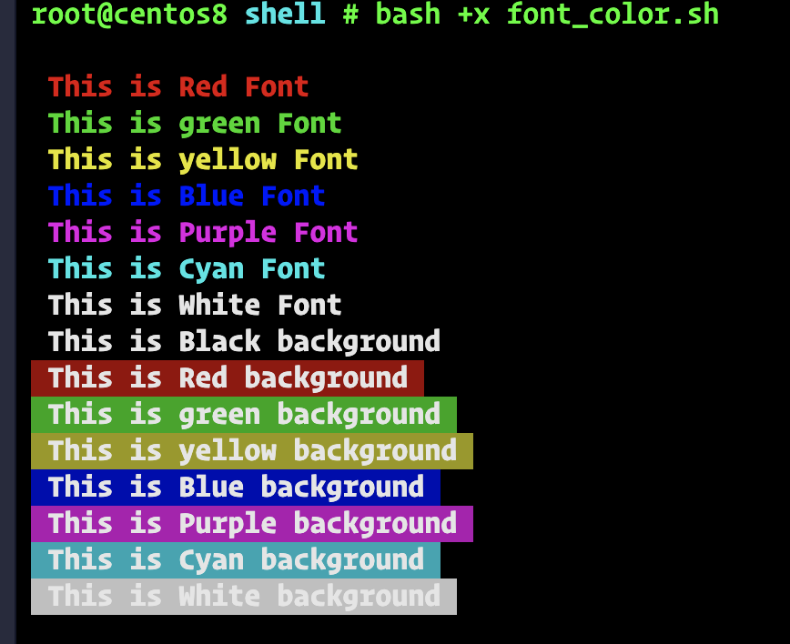

更多详细情况请移步 https://misc.flogisoft.com/bash/tip_colors_and_formatting

## 12. I/O重定向
**该部分不谈基本原理和具体实现，具体可查看 csapp 和 Linux内核中fd内容分析**

shell脚本（Linux中保存log等操作也是如此）中，常用的I/O重定向相关的`文件描述符（file description，简写fd）`有3个：
- stdin  ----- 标准输入 ----- 0 ----- 键盘
- stdout ----- 标准输出 ----- 1 ----- 屏幕
- stderr ----- 标准错误 ----- 2 ----- 错误消息输出到屏幕上

### 12.1 重定向符号及功能说明
|符号|描述|注意点|用法例子|
|:--|:--|:--|:--|
|`:> filename 或 > filename`|如果文件存在，则创建一个0长度的文件（与touch类似）|`:` 是一个占位符，不产生任何输出||
|`1>filename`|重定向stdout 到文件 filename中|||
|`1>>filename`|如果文件存在，则直接重定向追加到文件filename后面，如果不存在，则创建。|||||`2>filename`|重定向stderr到文件filename|||
|`2>>filename`|重定向并追加stderr到文件filename|||
|`&>filename`|将stdout 和 stderr 都重定向到文件filename|||
|`2>&1`|重定向stderr到stdout，将错误消息的输出，发送到与标准输出所指向的地方|||
|`i>&j`|重定向文件描述符i到j，指向i文件的所有输出都发送到j|||
|`>&j`|默认的，重定向fd 1（stdout）到j，所有传递到stdout的输出都送到j中去|||
|`0<filename 或 < filename`|从文件中接受输入||`grep search_word < filename`|
|`[j] <> filename`|将filename打开，然后将fd j分配给他，如果filename不存在，则创建。|如果fd未指定，则默认fd是0。||

### 12.2 关闭文件描述符
该使用场景本人暂未遇到，但是看到一些code在使用。

|符号|说明|
|:--|:--|
|`n<&-`|关闭输入文件描述符n|
|`0<&-,<&-`|关闭stdin||
|`n>&-`|关闭输出文件描述符n|
|`1>&-,>&-`|关闭stdout|

### 12.3 代码块重定向
代码块：就是 `{}` 括起来的命令。例如：for循环、while循环、until循环、case语句等。

具体用法：将重定向命令符号写在代码块的结尾。具体实例：

```sh
echo "This is Code block redirect Example"
echo 
{
    echo "SolerHO";
    echo "shell";
    echo "55"
} > infor.log   # 将代码块重定向输出到infor.log 文件中

{
    read -r name;
    read -r dev_lang;
    read -r age
} < infor.log   # 将infor.log重定向输入到代码块 

echo "My Name is $name, The programming language being used is $dev_lang, age is $age"
```

## 13. 正则表达式
**正则表达式（Regular Expression，简称regex或RE）**：由一系列的`特殊字符`组成的`字符串`，每个`特殊字符`都称为 `元字符`（一般解释为特定的含义）。

主要目的：用于搜索文本和字符串的操作。

一般情况下，可以通过 https://tool.oschina.net/regex/ 来验证自己写的是否可以匹配预期想要的结果。

### 13.1 正则表达式组成
正则表达式由`普通字符`和`元字符（也称为通配符）`组成的`集合`，用来查找匹配特定规则的字符文本。

一个正则表达式中，会包含以下一种或者三种：
- 一个字符集：只包含表示`字面意义的普通字符`。
- 锚：指定所要匹配的文本在文件中所处的位置。如 `^` 和 `$` 。
- 修饰符：扩大或缩小匹配范围
    - 常见的修饰符：`星号（*）`、`括号`和` 反斜杠（\）`。

### 13.2 POSIX字符类 `[:class:]`
|字符|描述|⚠️注意点|
|:--|:--|:--|
|`[:alnum:]`|匹配字母和数字，等价于`A-Za-z0-9`|
|`[:alpha]`|匹配字母，等价于` A-Za-z`|
|`[:blank:]`|匹配一个空格或一个制表符（tab）|
|`[:cntrl:]`|匹配控制字符|
|`[:digit:]`|匹配十进制数字，等价于0-9|
|`[:graph:]`|打印任何`可视的字符`。ASCII码范围：`33 ～ 126` 之间的字符|不包括空格字符（空格字符的ASCII码是32）|
|`[:print:]`|打印任何`可视的字符`。ASCII码范围：`33 ～ 126` 之间的字符|包含空格|
|`[:lower:]`|匹配小写字母，等价于 a-z||
|`[:upper:]`|匹配大写字母，等价于A-Z||
|`[:space:]`|匹配空白字符（空格和水平制表符）||
|`[:xdigit:]`|匹配16进制数字，等价于 0-9A-Fa-f||

`POSIX字符类`通常都要用`引号`或`双中括号`(`[[ ]]`)引起来。

### 13.2 扩展RE字符
|字符|描述|⚠️注意点|
|:--|:--|:--|
|星号 --- `*`|匹配它前面字符的任意多次，包括0次||
|点 --- `.`|匹配任意一个字符，除了换行符|⚠️注意：不包含换行符|
|脱字符号 --- `^`|匹配行首|有时候也表示字符集取反|
|美元符 --- `$`|在RE中匹配行尾|放在字符的后面，例如 `HO$ --- 表示以 HO结尾的字符`|
|中括号 --- `[...]`|在RE中，匹配中括号内字符集中的某一个字符|匹配其中之一|
|反斜杠 --- `\`|转义某个特殊含义的字符|如 `$ 符号`，使用反斜杠后，则表示普通字符|
|问号 --- `?`|匹配它前面字符|只能匹配1次或0次，一般用来`匹配单个字符`|
|加号 --- `+`|匹配它前面字符，一次或者多次|不能匹配0次的情况|
|竖线 --- `｜`|`或操作符`|匹配其中之一即可||
|转义的尖括号 --- `\<...\>`|匹配单词边界|括号需使用转义符，否则就是普通的字符|
|转义的大括号 --- `\{...\}`|括号中使用数字，则表示数字前面的RE匹配的次数|括号需使用转义符，否则就是普通的字符|

### 13.1 应用场景
    - Linux文本处理：sed、grep、awk、cat、tail、head、tee、uniq、sort
    - Linux工具：vim
    - 其他的编程语言

详细关于正则表达式内容阅读：https://www.runoob.com/regexp/regexp-tutorial.html

## 14. Linux / shell中一些命令说明
更多关于Linux相关的命令，请移步目录 Linux 关注知识点笔记。

关于里面的参数选项则不做出过多解读，只增加目前使用到的，后续有使用过其他的，也会再次更新。
### 14.1 set/ unset命令 -- 设置/取消赋值
内容只介绍在实际生产中的情况，更多的细节请阅读：https://www.computerhope.com/unix/uset.htm

- 在命令中直接输入 set，则显示系统中已经存在的一些shell变量。

- 设置新变量值

    ```sh
    set var[n]=value

    set -ex var
    ```
参数选项
- `-e（errexit）`：如果命令的返回值不是0，则直接退出shll的执行。
- `-x（）`：执行命令后，优先显示该命令及对应的参数。

### 14.2 read命令 -- 从控制台读取输入
参考：https://www.computerhope.com/unix/bash/read.htm

从屏幕标准输入中读取一行。默认情况下，read将`换行符`作视为行的结尾。

```sh
read [-ers] [-a array] [-d delim] [-i text] [-n nchars] [-N nchars]
     [-p prompt] [-t timeout] [-u fd] [name ...] [name2 ...]
```

在while循环中使用的 -r 则是直接使用原始的输入。例如

```sh
read -r name        # 读取控制台输入的name值

read -r age         # 读取控制前台输入的age值
```
### 14.3 declare命令 -- 声明shell变量
参考链接：https://www.computerhope.com/unix/bash/declare.htm

几个功能
- 声明shell变量和函数
- 设置属性
- 显示值

语法：

```sh
declare [-a] [-A] [-f] [-F] [-g] [-i] [-l] [-n] [-r]
        [-t] [-u] [-x] [-p] [name[=value]] [name[=value]] ...
```

具体使用的例子：
```sh
# 数组声明中使用，可加速数组的操作速度
# shellcheck中也会无异常
declare -a arr[]=(...)
```
### 14.4 let命令 -- 计算算术表达式
直接参考：https://www.computerhope.com/unix/bash/let.htm

功能：主要用于`计算算术表达式`。

let是Linux内置命令。而 `((...))`是复合命令。

```sh
let arg [arg ...]       # 和 ((...)) 直接计算算术表达式的思想类似

# 示例
let "var = 5";echo $var     # 直接返回 5
```

### 14.5 expr命令 -- 表达式
通用求值表达式：通过给定的操作（参数之间必须空格隔开）连接参数，并对参数求值。可使用算术、比较、字符串或逻辑操作。

```sh
expr 3 + 5      # 返回8
expr 3 \* 5     # 乘法符号需要转义，返回15
```

字符串操作的请查看字符串部分。

### 14.6 test命令 -- 判断检查
直接参考：https://www.computerhope.com/unix/test.htm

检查文件类型并比较值。

```sh
# 语法
test expression

# 应用 1：比较两个字符串（一般是判断字符串是否相等），比较运算符移步前面介绍部分 ---------> 比较运算符

# 应用 2：数字大小比较
```
## 15. Linux三剑客 --- grep
grep ---- global regular expression print，通过正则表达式来进行多用途文本搜索，属于一个过滤器。

语法格式：
```sh
grep [OPTION]... PATTERN [FILE]...      # pattern 可以是要搜索的字符串，也可以正则表达式

# 扩展命令 egrep 等价于 grep -E
# 扩展命令 fgrep 等价于 grep -F
```
### 15.1 常用查找option说明
|option|全称|说明|示例|
|:--:|:--:|:--|:--|
|`-i`|`--ignore-case`|在搜索时`忽略大小写`|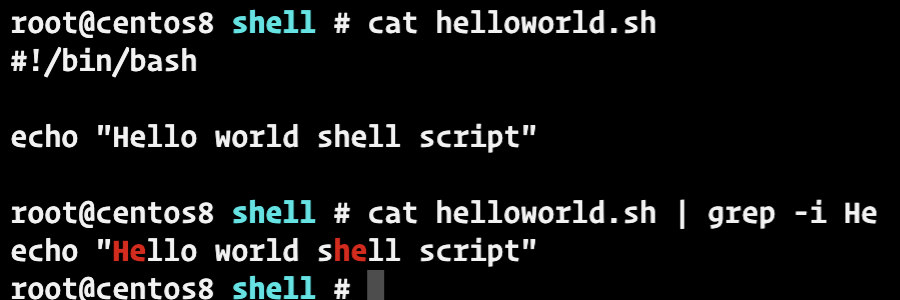|
|`-w`|`--word-regexp`|强制匹配整个字符单词|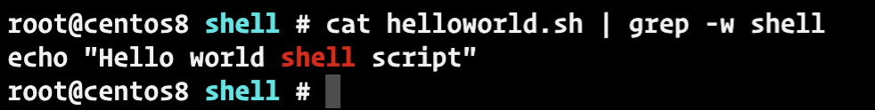|

### 15.2 输出控制option说明
|option|全称|说明|示例|
|:--:|:--:|:--|:--|
|`-c`|`--count`|显示pattern匹配的次数|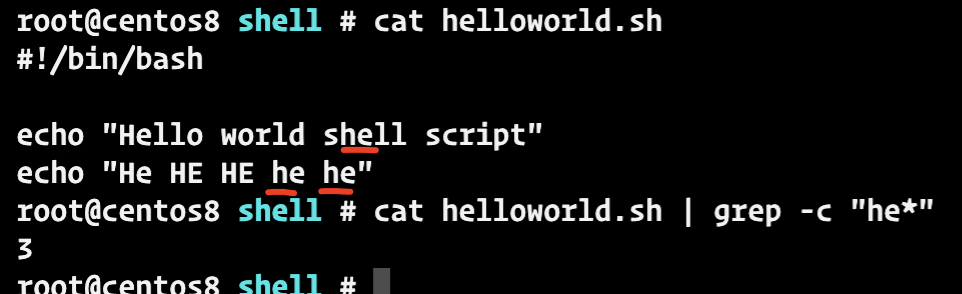|
|`-l`|`--files-with-matches`|显示文件中匹配字符的文件名|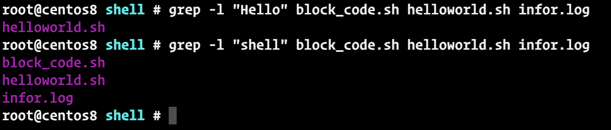|
|`-n`|`--line-number`|打印字符匹配所在的行|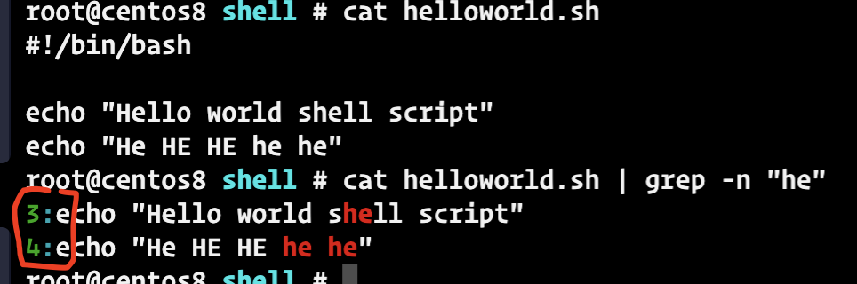|
|`-o`|`--only-matching`|仅显示匹配的字符串（可以和 `-n` 结合使用）|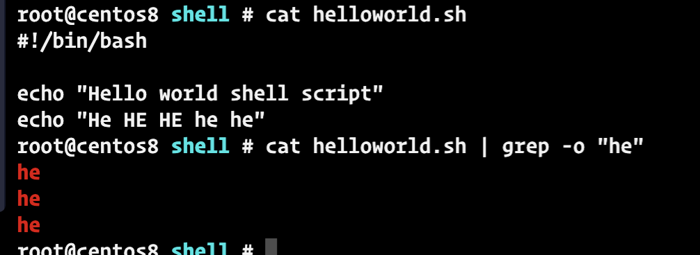|
|`-v`|`--invert-match`|小写，显示不匹配字符的内容|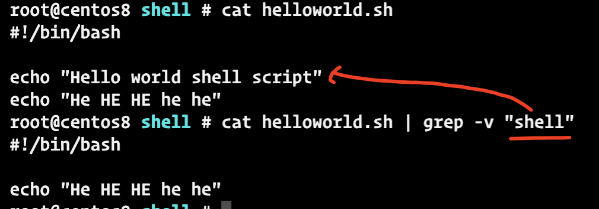|
|`-m`|`--max-count=NUM`|显示匹配字符的某一行的内容，适合绝对匹配|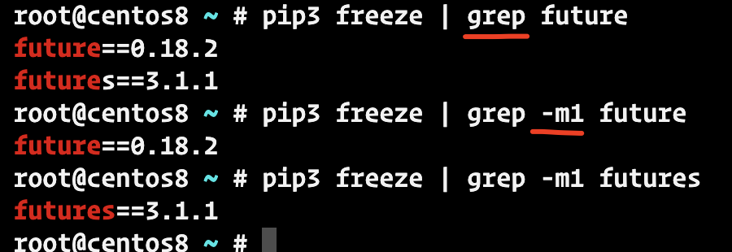|

### 15.3 其他两个常用RE进行的grep操作

- 显示文件中以 "xxxx" 开头的内容，使用符号 `^`
    
    ```sh
    cat xxxx.sh | grep "^xxxx"  # 以字符xxxx开头的内容行
    ```
    示例：

    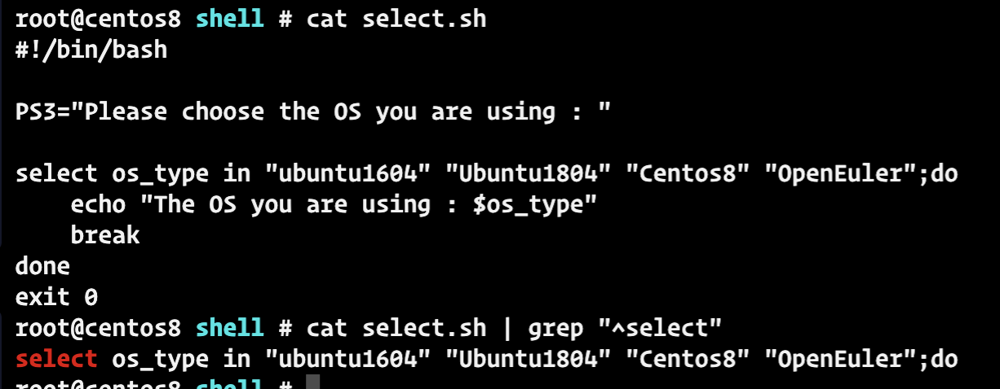

- 显示以 “xxxx” 结尾的文件名或者文件内容行，使用符号 `$`

    ```sh
    cat xxxx.sh | grep "xxxx$"        # 显示以 xxxx 内容结尾的内容行
    ```
    示例：
    
    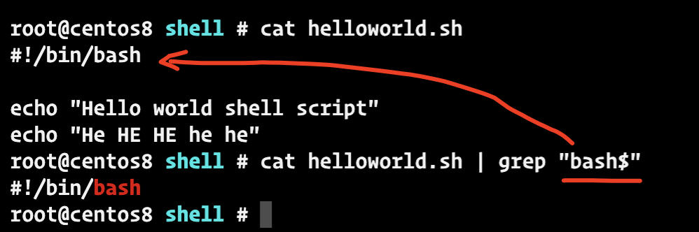


## 16. Linux三剑客 --- sed
sed ----- stream editor，是文本处理工具。主要是查找并替换文本字符串等。

语法：
```sh
sed [OPTION]... {script-only-if-no-other-script} [input-file]...
```

目前常用的格式为：

```sh
sed -i 's/查找的字符串（可包含RE）/替代内容/g' filename 

# 如果在s/... /g 中包含单引号，则外面直接使用 双引号（""），⚠️注意中间使用一些特殊字符
sed -i "s/查找的字符串（可包含RE）/替代内容/g" filename 
```
参数说明
- `i` 一般是默认，可设置为其他option，具体 `sed --help` 查看。
- `s` 查找
- `///`分隔符，也可以是其他的字符。例如在Jenkins的pipeline语法中使用时（`sed -i "s#search_word#target_word#g" filename`）
- `g` 表示直接全局替换 ----- global replacement。如果是需要忽略大小写时，可使用gi

几个具体的使用场景：`vim命令行模式`中操作和`直接操作文本`是相同原理
### 16.1 替换/修改字符串
```sh
# 全局替换（vim亦可）,且忽略大小写
sed -i "s/Hello/This is/g" helloworld.sh    # 将文件helloworld.sh 中 Hello替换为 This is

# 指定行替换（vim亦可），区分大小写
sed "10,20 s/42m/46m/g" color_print.sh      # 将color_print.sh中10～20行之间的颜色42m替换成46m
```

### 16.2 换行、删除
```sh
sed -i "s/ /\n/g" helloworld.sh      # 将文件中空格全部换行（\n）

sed "/\//d" helloworld.sh          # 将文件中的 /所在的行直接删除（也就是#!/bin/bash）
```
### 16.3 注释
```sh
# 全局删除
sed "/^#\|^$\| *#/d" checkpip_deps.sh       # 将文件中注释直接全部删除
```
### 16.4 查看指定的行范围的内容
```sh
sed -n -e "5,7p"  [-e ...] font_color.sh # 查看指定范围内的内容，可使用多个 -e来指定多个行区间

sed "5,7d" font_color.sh # 查看指定范围之外的内容，可重复使用
```
## 17. Linux三剑客 --- awk
awk ---- ，是报告可视化工具，文本格式化输出工具。主要处理文本文件。

### 17.1 语法格式
```sh
awk [-F 分隔符] '{ACTION}' filenames
awk [option] '{ACTION}' 
```
### 17.2 awk的原理
从第1行到最后1行，逐行去扫描文件内容，然后找到匹配pattern的行，最后进行指定的ACTION。
- 未指定pattern，则所有行都会被处理。
- 未指定ACTION，则屏幕直接打印匹配到行的内容。


## 18. shell脚本静态检查 --- shellcheck
详细内容直接阅读：https://github.com/koalaman/shellcheck，如下为使用方式：

### 安装方式 
```sh
# 方式 1 ： 直接命令行方式安装
apt-get install shellcheck   # Ubuntu

# centos暂时未使用 yum install ShellCheck，建议直接使用源码方式安装

# 方式 2 ： 源代码方式
wget https://github.com/koalaman/shellcheck/releases/download/v0.8.0/shellcheck-v0.8.0.linux.x86_64.tar.xz && tar -xf shellcheck-v0.8.0.linux.x86_64.tar.xz && cp shellcheck-v0.8.0/shellcheck /usr/bin/

# 查看shellcheck 版本
shellcheck --version
```

### 使用方式
直接调用shellcheck加上自己的脚本，可检测一些语法或者格式问题等。
```sh
shellcheck testop.sh
```
显示信息：

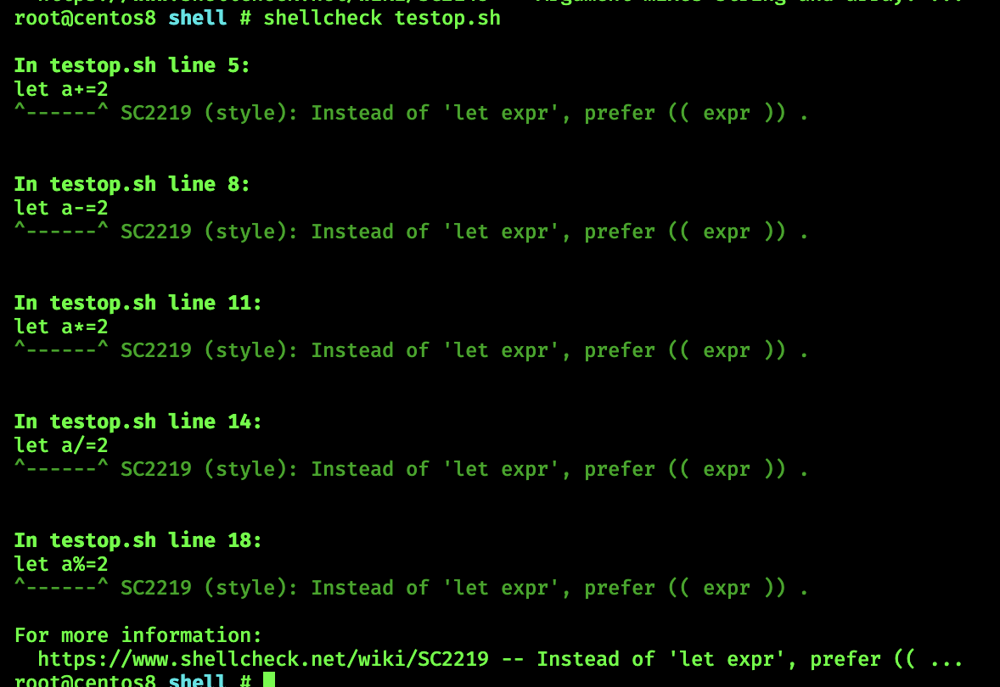

## 19. 参考资源
- 《高级bash脚本编程指南》
- https://juejin.cn/post/6844904045329514504
- https://juejin.cn/post/6962032698697187364
- https://myshell-note.readthedocs.io/en/latest/index.html
- https://github.com/koalaman/shellcheck
